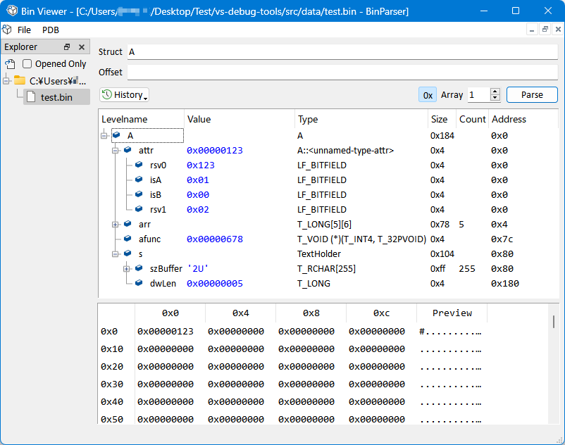

# Visual Studio Debug Tools

This is a simple project help you debug app compiled from Visual Studio by giving you a more powerful Expression view and Memory view.

## Installation

Clone this repo with all submodules:

```bash
$ git clone --recursive https://github.com/ukyouz/Visual-Studio-Debug-Tools
```

Then I recommandate using Python virtual environment such as:

```bash
$ virtualenv venv
```

Then if you use Powershell:

```bash
$ .\venv\Scripts\activate.ps1
$ cd src
$ pip install -r requirements.txt
```

You are good to go.

## Tools

There are 2 tools in this repo.

### VS Debugger


### Bin View



## Notes

If load `.pdb` process is too long, you can first make a binary file by:

```
$ cd src
$ python3 -m modules.pdbparser.pdbparser.picklepdb --pdb_file C:\path\to\your.pdb --out .\data\your.pdbin
```

Then load the `.pdbin` file, it will make you life easier.

## Support Languages

- C

Due to limitations of pdb parser in my other repo, currently only support C. May be extended in the future.
